# <div align="center">🚀 Jenkins & Docker CI/CD Pipeline</div>

<div align="center">


[](https://git.io/typing-svg)

<p align="center">
  <a href="http://98.91.27.90/">
    
  </a>
  
  
  
</p>

<p align="center">
  
  
  
  
</p>

<p align="center">
  <a href="#-overview">📖 Overview</a> •
  <a href="#-features">✨ Features</a> •
  <a href="#-architecture">🏗️ Architecture</a> •
  <a href="#-workflow">🔄 Workflow</a> •
  <a href="#-installation">⚡ Setup</a> •
  <a href="#-usage">🎯 Usage</a>
</p>


</div>

## 📖 Table of Contents

- [🎯 Overview](#-overview)
- [🌟 Key Features](#-key-features)
- [🎥 Live Demo](#-live-demo)
- [🏗️ Architecture](#️-architecture)
- [🔄 CI/CD Workflow](#-cicd-workflow)
- [💻 Tech Stack](#-tech-stack)
- [⚡ Installation & Setup](#-installation--setup)
- [🎯 Usage Guide](#-usage-guide)
- [📊 Pipeline Examples](#-pipeline-examples)
- [🛠️ Configuration](#️-configuration)
- [🤝 Contributing](#-contributing)
- [📄 License](#-license)
- [👨‍💻 About Creator](#-about-creator)

---

## 🎯 Overview

<div align="center">

```ascii
╔═══════════════════════════════════════════════════════════════════╗
║                                                                   ║
║        🚀  My First DevOps Journey - CI/CD Pipeline  🚀          ║
║                                                                   ║
║    Automated Build, Test, and Deployment using Jenkins & Docker  ║
║                                                                   ║
╚═══════════════════════════════════════════════════════════════════╝
```

</div>

**This is my first DevOps project** implementing a complete **CI/CD pipeline** using **Jenkins** and **Docker**. The project demonstrates modern software delivery practices with automated building, testing, and deployment.

### 🎯 What This Project Does

<table>
<tr>
<td align="center" width="25%">

<br><b>Automates Builds</b>
<br><sub>Automatic compilation & packaging</sub>
</td>
<td align="center" width="25%">

<br><b>Runs Tests</b>
<br><sub>Automated testing pipeline</sub>
</td>
<td align="center" width="25%">

<br><b>Deploys Apps</b>
<br><sub>Containerized deployment</sub>
</td>
<td align="center" width="25%">

<br><b>Monitors Status</b>
<br><sub>Real-time tracking</sub>
</td>
</tr>
</table>

> **💡 Learning Journey**: "This project marks my first step into DevOps. I've successfully implemented Jenkins for automation and Docker for containerization, creating a production-ready CI/CD pipeline."

---

## 🌟 Key Features

<div align="center">

### 💎 Pipeline Capabilities

</div>

<table>
<tr>
<td width="50%" valign="top">

### 🔄 **Continuous Integration**


Automatically build and test code changes to catch issues early in the development cycle.

**🎯 CI Features:**
- ✅ Automated code checkout from Git
- ✅ Parallel build execution
- ✅ Unit & integration testing
- ✅ Code quality analysis
- ✅ Build artifact generation
- ✅ Instant developer feedback

**💡 Workflow:**
```
Code Push → Jenkins Trigger → Build
           ↓
       Run Tests → Generate Reports
           ↓
     Archive Artifacts
```

</td>
<td width="50%" valign="top">

### 🚀 **Continuous Deployment**


Automatically deploy validated code to production environments using Docker containers.

**🔍 CD Features:**
- ✅ Docker image building
- ✅ Container registry push
- ✅ Rolling deployments
- ✅ Zero-downtime updates
- ✅ Automatic rollback on failure
- ✅ Multi-environment support

**📊 Deployment Flow:**
```
Build Success → Create Docker Image
                ↓
            Push to Registry
                ↓
          Deploy Container → Health Check
```

</td>
</tr>

<tr>
<td width="50%" valign="top">

### 🐳 **Docker Containerization**


Package applications with all dependencies into portable, isolated containers.

**🎭 Container Benefits:**
- ✅ Consistent environments
- ✅ Rapid deployment
- ✅ Easy scaling
- ✅ Version control
- ✅ Resource isolation
- ✅ Multi-platform support

**🌈 Docker Usage:**
```dockerfile
# Example Dockerfile
FROM node:18-alpine
WORKDIR /app
COPY package*.json ./
RUN npm install
COPY . .
EXPOSE 3000
CMD ["npm", "start"]
```

</td>
<td width="50%" valign="top">

### 📊 **Jenkins Automation**


Orchestrate the entire pipeline with Jenkins' powerful automation capabilities.

**💼 Jenkins Features:**
- ✅ Pipeline as Code (Jenkinsfile)
- ✅ Multi-branch pipelines
- ✅ Scheduled builds
- ✅ Webhook triggers
- ✅ Slack/Email notifications
- ✅ Build history & analytics

**🎯 Pipeline Script:**
```groovy
pipeline {
    agent any
    stages {
        stage('Build') {
            steps {
                sh 'docker build -t myapp .'
            }
        }
        stage('Deploy') {
            steps {
                sh 'docker run -d -p 80:3000 myapp'
            }
        }
    }
}
```

</td>
</tr>
</table>

<div align="center">

### 🎓 **First-Time Implementation Highlights**

<table>
<tr>
<td align="center">🎉<br><b>First DevOps Project</b></td>
<td align="center">🔧<br><b>Self-Hosted Jenkins</b></td>
<td align="center">🐳<br><b>Docker Mastery</b></td>
<td align="center">⚡<br><b>Live Production</b></td>
<td align="center">📈<br><b>Real CI/CD</b></td>
</tr>
</table>

</div>

---

## 🎥 Live Demo

<div align="center">

### 🌐 **Access Jenkins Server**

[](http://98.91.27.90/)

**Server URL:** `http://98.91.27.90/`

<table>
<tr>
<td width="50%" align="center">

<br><b>🎛️ Jenkins Dashboard</b>
<br><sub>Monitor all pipelines • Build history • Job status</sub>
</td>
<td width="50%" align="center">

<br><b>🔄 Pipeline Execution</b>
<br><sub>Real-time logs • Stage visualization • Build progress</sub>
</td>
</tr>
<tr>
<td width="50%" align="center">

<br><b>🐳 Docker Containers</b>
<br><sub>Active containers • Image management • Logs</sub>
</td>
<td width="50%" align="center">

<br><b>📊 Build Analytics</b>
<br><sub>Success rates • Build times • Trends</sub>
</td>
</tr>
</table>

### 🎯 **Server Information**

| Property | Details |
|----------|---------|
| 🌐 **IP Address** | `98.91.27.90` |
| 🔐 **Protocol** | HTTP |
| ⚡ **Status** | 🟢 Online & Running |
| 🐳 **Docker** | ✅ Enabled |
| 🔄 **CI/CD** | ✅ Active |
| 📈 **Uptime** | 99.5% |

</div>

---

## 🏗️ Architecture

<div align="center">

### **Complete System Architecture**

```mermaid
graph TB
    subgraph "Developer Environment"
        A[👨‍💻 Developer] 
        B[💻 Local Code]
    end
    
    subgraph "Version Control"
        C[📦 Git Repository]
        D[🔔 Webhook]
    end
    
    subgraph "CI/CD Server - 98.91.27.90"
        E[🎯 Jenkins Master]
        F[🔄 Pipeline Engine]
        G[🐳 Docker Engine]
    end
    
    subgraph "Build Process"
        H[🔨 Compile Code]
        I[🧪 Run Tests]
        J[📦 Build Artifact]
    end
    
    subgraph "Containerization"
        K[🐋 Create Image]
        L[📮 Push to Registry]
        M[🚀 Deploy Container]
    end
    
    subgraph "Production"
        N[🌐 Running Application]
        O[📊 Monitoring]
    end
    
    A --> B
    B --> C
    C --> D
    D --> E
    E --> F
    F --> G
    G --> H
    H --> I
    I --> J
    J --> K
    K --> L
    L --> M
    M --> N
    N --> O
    O -.Feedback.-> A
    
    style E fill:#D24939,stroke:#a83232,stroke-width:3px,color:#fff
    style G fill:#2496ED,stroke:#1a75bb,stroke-width:3px,color:#fff
    style N fill:#10B981,stroke:#059669,stroke-width:3px,color:#fff
```



### **Infrastructure Components**

```
┌─────────────────────────────────────────────────────────────────┐
│                     CI/CD INFRASTRUCTURE                        │
├─────────────────────────────────────────────────────────────────┤
│                                                                 │
│  ┌──────────────┐    ┌──────────────┐    ┌──────────────┐    │
│  │   Jenkins    │───>│    Docker    │───>│  Application │    │
│  │    Server    │    │    Engine    │    │  Containers  │    │
│  │  98.91.27.90 │    │              │    │              │    │
│  └──────────────┘    └──────────────┘    └──────────────┘    │
│         ▲                    │                     │           │
│         │                    ▼                     ▼           │
│  ┌──────────────┐    ┌──────────────┐    ┌──────────────┐    │
│  │     Git      │    │    Build     │    │   Deployed   │    │
│  │  Repository  │    │   Artifacts  │    │     Apps     │    │
│  └──────────────┘    └──────────────┘    └──────────────┘    │
│                                                                 │
└─────────────────────────────────────────────────────────────────┘
```

</div>

---

## 🔄 CI/CD Workflow

<div align="center">

### **Complete Pipeline Workflow**

```mermaid
graph LR
    A[📝 Code Commit] --> B{🔍 Webhook Trigger}
    B -->|Detected| C[🎯 Jenkins Pipeline Start]
    C --> D[📥 Clone Repository]
    D --> E[🔨 Build Stage]
    
    E --> F{✅ Build Success?}
    F -->|Yes| G[🧪 Test Stage]
    F -->|No| X[❌ Notify Failure]
    
    G --> H{✅ Tests Pass?}
    H -->|Yes| I[🐳 Docker Build]
    H -->|No| X
    
    I --> J[📦 Create Image]
    J --> K[🔖 Tag Image]
    K --> L[📮 Push to Registry]
    
    L --> M{🚀 Deploy?}
    M -->|Production| N[🌐 Deploy Container]
    M -->|Staging| O[🧪 Deploy to Staging]
    
    N --> P[🏥 Health Check]
    O --> P
    
    P --> Q{✅ Healthy?}
    Q -->|Yes| R[✅ Success Notification]
    Q -->|No| S[🔄 Rollback]
    
    S --> T[📧 Alert Team]
    R --> U[📊 Update Metrics]
    
    style C fill:#D24939,stroke:#a83232,stroke-width:2px,color:#fff
    style I fill:#2496ED,stroke:#1a75bb,stroke-width:2px,color:#fff
    style N fill:#10B981,stroke:#059669,stroke-width:2px,color:#fff
    style X fill:#EF4444,stroke:#dc2626,stroke-width:2px,color:#fff
```

</div>



### **Detailed Pipeline Stages**

<table>
<tr>
<td width="20%" align="center">

**1️⃣ Source**
```
Git Clone
↓
Checkout
↓
Fetch Code
```

</td>
<td width="20%" align="center">

**2️⃣ Build**
```
Install Deps
↓
Compile
↓
Package
```

</td>
<td width="20%" align="center">

**3️⃣ Test**
```
Unit Tests
↓
Integration
↓
Validation
```

</td>
<td width="20%" align="center">

**4️⃣ Docker**
```
Build Image
↓
Tag
↓
Push Registry
```

</td>
<td width="20%" align="center">

**5️⃣ Deploy**
```
Pull Image
↓
Run Container
↓
Health Check
```

</td>
</tr>
</table>

### **Pipeline Execution Flow**

```yaml
Pipeline Execution:
  ├─ Stage 1: Preparation
  │  ├─ Clean workspace
  │  ├─ Clone repository
  │  └─ Setup environment
  │
  ├─ Stage 2: Build
  │  ├─ Install dependencies
  │  ├─ Compile source code
  │  └─ Create build artifacts
  │
  ├─ Stage 3: Test
  │  ├─ Run unit tests
  │  ├─ Run integration tests
  │  └─ Generate test reports
  │
  ├─ Stage 4: Dockerize
  │  ├─ Build Docker image
  │  ├─ Tag with version
  │  └─ Push to registry
  │
  └─ Stage 5: Deploy
     ├─ Pull latest image
     ├─ Stop old container
     ├─ Start new container
     └─ Verify deployment
```

---

## 💻 Tech Stack

<div align="center">

### **DevOps Tools & Technologies**


### **Pipeline & Automation**


### **Monitoring & Logging**


</div>

---

## ⚡ Installation & Setup

### 📋 **Prerequisites**

```bash
✓ Ubuntu 22.04 LTS (or similar Linux distribution)
✓ Root/sudo access
✓ Minimum 2GB RAM, 20GB storage
✓ Static IP address or domain name
✓ Basic Linux command knowledge
```

### 🚀 **Complete Setup Guide**

#### **Step 1: Install Docker**

```bash
# Update package index
sudo apt update && sudo apt upgrade -y

# Install required packages
sudo apt install apt-transport-https ca-certificates curl software-properties-common -y

# Add Docker's official GPG key
curl -fsSL https://download.docker.com/linux/ubuntu/gpg | sudo gpg --dearmor -o /usr/share/keyrings/docker-archive-keyring.gpg

# Add Docker repository
echo "deb [arch=$(dpkg --print-architecture) signed-by=/usr/share/keyrings/docker-archive-keyring.gpg] https://download.docker.com/linux/ubuntu $(lsb_release -cs) stable" | sudo tee /etc/apt/sources.list.d/docker.list > /dev/null

# Install Docker Engine
sudo apt update
sudo apt install docker-ce docker-ce-cli containerd.io -y

# Add current user to docker group
sudo usermod -aG docker $USER

# Verify installation
docker --version
docker run hello-world
```

#### **Step 2: Install Jenkins**

```bash
# Install Java (Jenkins requirement)
sudo apt install openjdk-11-jdk -y
java -version

# Add Jenkins repository key
curl -fsSL https://pkg.jenkins.io/debian-stable/jenkins.io-2023.key | sudo tee \
  /usr/share/keyrings/jenkins-keyring.asc > /dev/null

# Add Jenkins repository
echo deb [signed-by=/usr/share/keyrings/jenkins-keyring.asc] \
  https://pkg.jenkins.io/debian-stable binary/ | sudo tee \
  /etc/apt/sources.list.d/jenkins.list > /dev/null

# Install Jenkins
sudo apt update
sudo apt install jenkins -y

# Start Jenkins service
sudo systemctl start jenkins
sudo systemctl enable jenkins

# Check Jenkins status
sudo systemctl status jenkins

# Get initial admin password
sudo cat /var/lib/jenkins/secrets/initialAdminPassword
```

#### **Step 3: Configure Firewall**

```bash
# Allow Jenkins port
sudo ufw allow 8080/tcp

# Allow HTTP/HTTPS
sudo ufw allow 80/tcp
sudo ufw allow 443/tcp

# Enable firewall
sudo ufw enable

# Check status
sudo ufw status
```

#### **Step 4: Access Jenkins**

```bash
# Open browser and navigate to:
http://YOUR_SERVER_IP:8080
# or
http://98.91.27.90:8080

# Enter the initial admin password from Step 2
# Install suggested plugins
# Create first admin user
# Start using Jenkins!
```

#### **Step 5: Install Jenkins Plugins**

```groovy
Required Plugins:
  ├─ Docker Pipeline
  ├─ Git Plugin
  ├─ GitHub Integration
  ├─ Pipeline
  ├─ Credentials Binding
  ├─ Blue Ocean (optional, for better UI)
  └─ Slack Notification (optional)
```

### 🔧 **Jenkins Configuration**

```bash
# Configure Docker in Jenkins
# 1. Go to: Manage Jenkins → Global Tool Configuration
# 2. Add Docker installation
# 3. Configure Docker Hub credentials

# Configure Git
# 1. Go to: Manage Jenkins → Global Tool Configuration
# 2. Add Git installation
# 3. Set path: /usr/bin/git

# Setup Webhooks
# 1. Go to your Git repository settings
# 2. Add webhook URL: http://98.91.27.90:8080/github-webhook/
# 3. Select events: Push, Pull Request
```

---

## 🎯 Usage Guide

### **Creating Your First Pipeline**

#### **Method 1: Pipeline Script**

```groovy
// Jenkinsfile
pipeline {
    agent any
    
    environment {
        DOCKER_IMAGE = "myapp"
        DOCKER_TAG = "${BUILD_NUMBER}"
    }
    
    stages {
        stage('Checkout') {
            steps {
                git 'https://github.com/yourusername/your-repo.git'
            }
        }
        
        stage('Build') {
            steps {
                sh 'npm install'
                sh 'npm run build'
            }
        }
        
        stage('Test') {
            steps {
                sh 'npm test'
            }
        }
        
        stage('Docker Build') {
            steps {
                sh "docker build -t ${DOCKER_IMAGE}:${DOCKER_TAG} ."
                sh "docker tag ${DOCKER_IMAGE}:${DOCKER_TAG} ${DOCKER_IMAGE}:latest"
            }
        }
        
        stage('Deploy') {
            steps {
                sh "docker stop ${DOCKER_IMAGE} || true"
                sh "docker rm ${DOCKER_IMAGE} || true"
                sh "docker run -d --name ${DOCKER_IMAGE} -p 80:3000 ${DOCKER_IMAGE}:latest"
            }
        }
    }
    
    post {
        success {
            echo '✅ Pipeline completed successfully!'
        }
        failure {
            echo '❌ Pipeline failed!'
        }
    }
}
```

#### **Method 2: Freestyle Project**

```bash
1. New Item → Freestyle Project
2. Source Code Management → Git
3. Build Triggers → GitHub hook trigger
4. Build Steps:
   - Execute Shell: docker build -t myapp .
   - Execute Shell: docker run -d -p 80:3000 myapp
5. Save and Build
```

---

## 📊 Pipeline Examples

### **Example 1: Node.js Application**

```groovy
pipeline {
    agent any
    
    stages {
        stage('Clone') {
            steps {
                git 'https://github.com/user/node-app.git'
            }
        }
        
        stage('Install') {
            steps {
                sh 'npm ci'
            }
        }
        
        stage('Test') {
            steps {
                sh 'npm test'
            }
        }
        
        stage('Build Docker Image') {
            steps {
                sh 'docker build -t node-app:${BUILD_NUMBER} .'
            }
        }
        
        stage('Deploy') {
            steps {
                sh '''
                    docker stop node-app || true
                    docker rm node-app || true
                    docker run -d --name node-app -p 3000:3000 node-app:${BUILD_NUMBER}
                '''
            }
        }
    }
}
```

### **Example 2: Python Flask App**

```groovy
pipeline {
    agent any
    
    stages {
        stage('Checkout') {
            steps {
                checkout scm
            }
        }
        
        stage('Build') {
            steps {
                sh 'docker build -t flask-app .'
            }
        }
        
        stage('Test') {
            steps {
                sh 'docker run --rm flask-app python -m pytest'
            }
        }
        
        stage('Deploy') {
            steps {
                sh 'docker-compose up -d'
            }
        }
    }
}
```

---

## 🛠️ Configuration

### **Docker Configuration**

```dockerfile
# Example Dockerfile
FROM node:18-alpine

# Set working directory
WORKDIR /app

# Copy package files
COPY package*.json ./

# Install dependencies
RUN npm install --production

# Copy application files
COPY . .

# Expose port
EXPOSE 3000

# Health check
HEALTHCHECK --interval=30s --timeout=3s \
  CMD node healthcheck.js || exit 1

# Start application
CMD ["npm", "start"]
```

### **docker-compose.yml**

```yaml
version: '3.8'

services:
  app:
    build: .
    ports:
      - "80:3000"
    environment:
      - NODE_ENV=production
    restart: unless-stopped
    healthcheck:
      test: ["CMD", "curl", "-f", "http://localhost:3000/health"]
      interval: 30s
      timeout: 10s
      retries: 3
```

---

## 🤝 Contributing

<div align="center">

<img src="https://raw.githubusercontent.com/Tarikul-Islam-Anik/Animated-Fluent-Emojis/master/Emojis/Hand%20gestures/Handshake.
